## ESG 보고서 요약 자동화 시스템 개발 프로젝트
ESG 보고서 작성을 위한 데이터 관리 및 RAG를 활용한 LLM 결과물 도출 작업을 수행하는 웹 서비스\
목표 회사는 SK하이닉스(https://sustainability.skhynix.com/datacenter?section=sustainReport)이며 2025년 보고서를 정답 데이터로 가정하여 진행

### 시연영상
[](https://youtu.be/pESg_nJDVQE)
[](https://youtu.be/U-cFHq48R-k)

### 프론트 구성
0. 로그인
1. 간단한 챗봇 claude tavily online search
2. raw db 도출 프로세스 확인 및 그래프 시각화
3. 업로드된 MySQL DB 확인
4. [QA_GRAPH] 챗봇 스타일 Q&A 플로우
5. [REPORT_GRAPH] ESG 보고서 일괄 자동 작성 플로우
6. [SECTION_GRAPH] ESG 보고서 단일 섹션 HITL 작성/수정 플로우

</br>

### 실행 방법
AWS에 도커를 설치하여 진행
1. 본인이 원하는 성능의 AWS 인스턴스를 시작하여 다음 시크릿키를 깃허브에 설정:
- `EC2_HOST`: AWS EC2 "퍼블릭 IPv4" 주소와 `EC2_SSH_KEY`: 인스턴스를 시작할때 설정한 본인 `.pem` 개인키\
깃허브 설정 위치는 Settings -> Secrets and variables -> Actions -> [New repository secret] -> [Add Secret]\
(Elastic IP가 아니면 인스턴스를 재시작 할때마다 변경되므로 `EC2_HOST`값을 수정해 주어야 한다)
2. `MobaXterm` 혹은 `PuTTY`&`FileZilla`로 인스턴스 로그인
- port: `22` | username: `ubuntu` | private key 로그인: `.pem`(`.ppk`) 파일 선택
3. 터미널에 접속해서 root 패스워드 설정
- `sudo passwd root` -> 본인이 원하는 비밀번호 -> `su root` 로그인
4. 인스턴스 최초 실행이라면 도커 설치, 이미 설치되어 있다면 건너뛰기
- 설치 가이드라인은 "AWS에_도커설치.docx" 파일 참조
5. 설치가 완료되었다면, `.env.production` 파일을 아래의 내용을 채워서 `.env.development` 파일과 함께 **AWS EC2에 업로드**: `/home/ubuntu/env`(env 폴더 만들어서 그안에 업로드)\
  ㄴ **/home/ubuntu/env/.env.development**\
  ㄴ **/home/ubuntu/env/.env.production**\
`.env.development` 파일내 `DB_IP=mysql80` & `REDIS_HOST=redis7alpine` 설정값 확인 (**로컬IP 127.0.0.1로 설정되어 있으면 에러**)

< `.env.production` 파일 내용 >\
JWT_SECRET_KEY는 임의로 설정한 값, 다른 값으로 설정해도 문제없이 작동
``` .env.production
# JWT관련
JWT_SECRET_KEY=dfkjgwkelk35klvnwe2340flkdsCCTVl1244cfncnsdr3123lfncdlk124sksks
JWT_ALGORITHM=HS256

# (택1) Claude API 또는 AWS Bearer Token Bedrock
# 개인 Claude API
ANTHROPIC_API_KEY=<본인의_클로드_API키>
# 조직 AWS Bearer Token Bedrock API
BEDROCK_API_KEY=<조직의_클로드_API키>
AWS_REGION=us-east-1

# Tavily 검색
TAVILY_API_KEY=<본인의_타빌리_API키>
```

**env 파일이 준비되지 않으면 실행 불가**

6. 깃허브 레포지토리를 rsync로 EC2에 파일 동기화하기 위해 Actions -> Deploy -> Run workflow 버튼으로 수동 실행, 혹은 git push 기능으로 실행
- `.github\workflows\main.yml`을 통해 GitHub Actions가 트리거되려면 main 브랜치에 최초 1회는 push 필요
7. `http://<AWS_IP>:8000`로 접속하여 로그인 화면이 나타난다면 (`0.0.0.0`기준 포트번호:`8000` 열기)
- MySQL Workbench로 AWS EC2의 mysql:8.0 도커 컨테이너에 접속하여 `/datasets/esg_db.sql` 데이터를 import 한 뒤 로그인 (ID: `dd` Password: `dd`)

< MySQL Workbench 연결>
```
SSH Hostname: <AWS_IP>:22
SSH Username: ubuntu
SSH Key File: <.pem개인키>
MySQL Hostname: 127.0.0.1
MySQL Server Port: 3306
Username: root
```
윈도우나 Mac OS를 사용하는 로컬환경에서 간단히 실행하고자 한다면 `.env.production` 파일을 기존 `.env.development` 파일 위치에 저장한 뒤,
도커에 MySQL:8.0, Redis:7-alpine, Ollama 컨테이너를 실행하여 `/datasets/esg_db.sql` 데이터를 import하여 진행

8. RAG화면에서 보도자료, 뉴스룸, 보고서, 데이터의 개수가 0건으로 표시된다면 `chroma_db` 폴더가 없는 상황이므로 "⟳ ChromaDB 인덱싱" 최초 1회 진행 필요

</br>

### 데이터 크롤링 및 전처리 (Optional) - 필요 라이브러리 requirements.txt에 미포함
`preprocess/data_prep_craw.py`
- 뉴스와 보도기사 크롤링의 경우 SK하이닉스는 사내에서 자체적으로 운영중인 press/newsroom이 있어 각 홈페이지들을 크롤링하여 mysql에 저장
- 구글/네이버와 같은 검색 포털에서 크롤링을 진행할 경우 너무 많은 뉴스, 일정하지 않은 기사 퀄리티, 중복되는 내용 등의 문제가 있을것으로 예상
- ESG보고서 작성이 목표이므로 홈페이지 내 "ESG" 검색 결과들만 선택적으로 크롤링 (https://news.skhynix.co.kr/?s=ESG)
- 본래 많이 사용되는 bs4를 기반으로 크롤링을 진행하였으나 홈페이지의 보안정책의 문제로 `Selenium` 라이브러리를 활용

`preprocess/data_prep_excel.py`
- 수치데이터로 SK하이닉스 보고서 홈페이지의 E,S,G 부문 2019~2024년 데이터를 다운로드하여 활용\
  ㄴ `datasets/SK_하이닉스_성과_및_실적_데이터_환경(E)_2019-2024.xlsx`\
  ㄴ `datasets/SK_하이닉스_성과_및_실적_데이터_사회(S)_2019-2024.xlsx`\
  ㄴ `datasets/SK_하이닉스_성과_및_실적_데이터_지배구조(G)_2019-2024.xlsx`
- mysql과 chromadb 활용을 위해 파일 컬럼명 간단히 수기로 추가 및 수정하여 활용

`preprocess/보고서_메타데이터_추출.ipynb` & `preprocess/data_prep_report.py`
- SK하이닉스 보고서 홈페이지에서 2023년, 2024년 보고서를 다운받아 **E=초록 / S=파랑 / G=핑크** 부분으로 수기로 pdf에 하이라이트 처리
- 이를 chromadb에 업로드 하기위해 `marker-pdf` 라이브러리로 텍스트 추출, `datasets/content_db.xlsx` 파일 형식으로 수동 변환 및 mysql 업로드
- 최종적으로, 위의 데이터 모두 `chroma_db` 폴더에 저장

`preprocess/data_prep_csv.py`
- 수식등이 적용되어 있는 더미데이터 (임의로 만든 데이터) `datasets/RAWDATA_GHG.xlsx`를 만들어 두개의 csv 파일로 변환: `datasets/RAWDATA_GHG_FORMULA.csv`, `datasets/RAWDATA_GHG_QUANTITY.csv`
- 두 파일과 `datasets/RAWDATA_ERP.csv` 파일이 원청에서 받은 데이터라고 가정후 mysql db에 업로드
- 이후 엑셀에 있는 수식을 SQL 문법으로 적용하여 page2.html에 시각화

</br>

#

</br>

### 업데이트 진행 사항
**2026-04-28: 로그인 및 간단한 챗봇 구현**
- 전체적으로 기본 포트번호 사용
- 회원가입 HTML은 구현하지 않았으므로 docs에서 진행 (Pydantic `users` 테이블)
- 로그인은 필요시에 회원가입 진행 혹은 아이디,비밀번호 `dd` & `dd` 로 로그인 (EmailStr, SecretStr이 아닌 간단히 규칙없는 Str타입)
- Redis access/refresh 토큰 각각 24시간 4주로 설정, 페이지 우측 최상단에 카운트 다운 및 강제 로그아웃 기능
- 챗봇은 클로드 API 기반으로 최근 user/assistant 3쌍의 대화만을 입력으로 사용하여 토큰 비용 이슈 방지 (장기 메모리 설정은 구현되어 있지 않음)
- 모든 회원별 `ForeignKey("users.id")` 와 매칭되어 `conversations` & `messages` (relationship) DB에 비동기식 저장
- 왼쪽 사이드바에서 대화가 기록되어 있는 채팅창 이름 수정 혹은 삭제 가능
- 일반적인 여러 챗봇 웹사이트 UI를 참고하여 구성
<p align="left">
  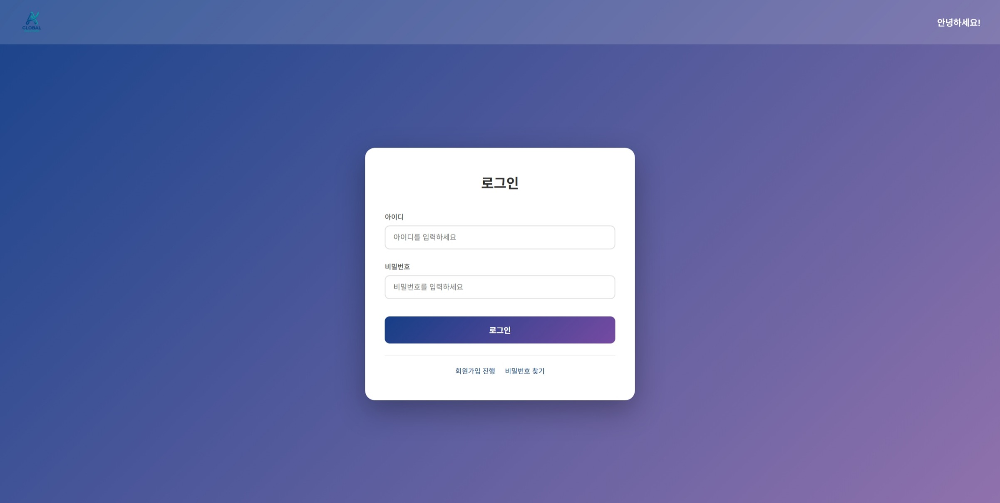
  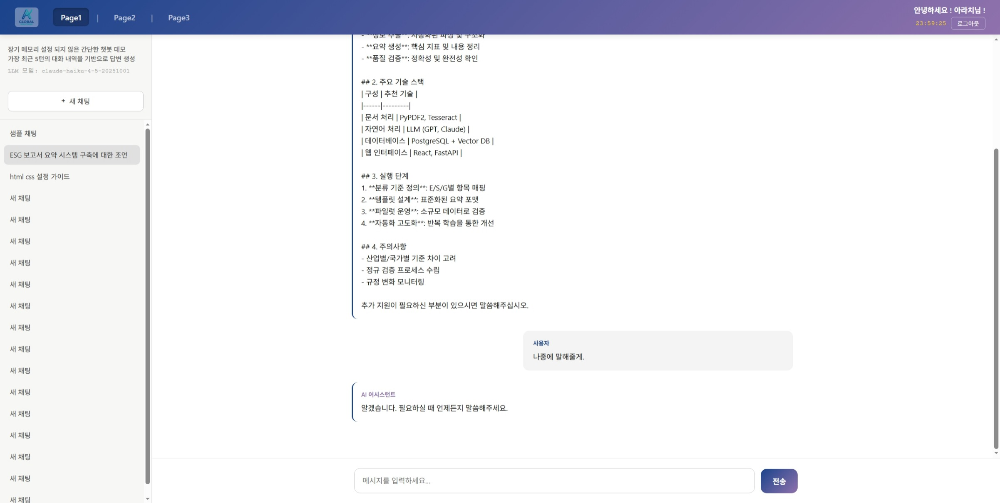
</p>
</br>

**2026-05-26: 향후 RAG사용을 위한 DB 전처리 및 시각화 구현**
- `app/preprocess/data_prep_excel.py` 코드를 통해 `datasets` 폴더의 ESG 엑셀파일 MySQL에 업로드
- `app/preprocess/data_prep_craw.py` 코드를 통해 SK하이닉스 홈페이지의 뉴스 및 게시글 크롤링, 클리어링 및 MySQL에 업로드\
  `BeautifulSoup` 패키지로는 크롤링이 되지 않아 `Selenium` 으로 크롤링, 다른 버전의 크롤링 코드는 간단히 참고만
- MySQL의 최종 데이터베이스는 `app/datasets/esg_db.sql` 파일을 로드하여 확인 가능하므로 전처리`app/preprocess/` 코드는 따로 실행하지 않아도 됨
- 이 외의 같은 폴더 내 여러 파일들은 추후 활용되거나 간단히 참고용으로 사용을 고려
- 간단한 시각화 결과는 아래의 스크린샷 이미지와 같음
<p align="left">
  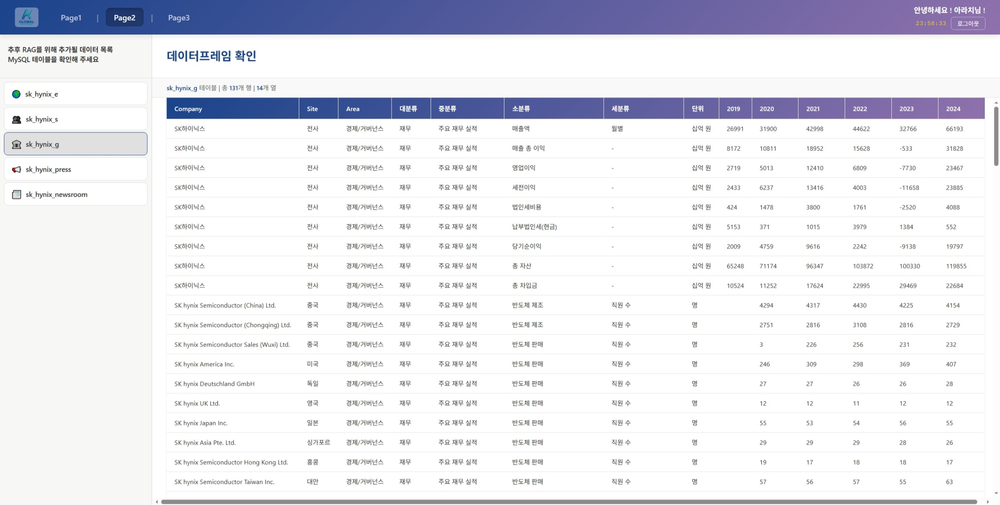
  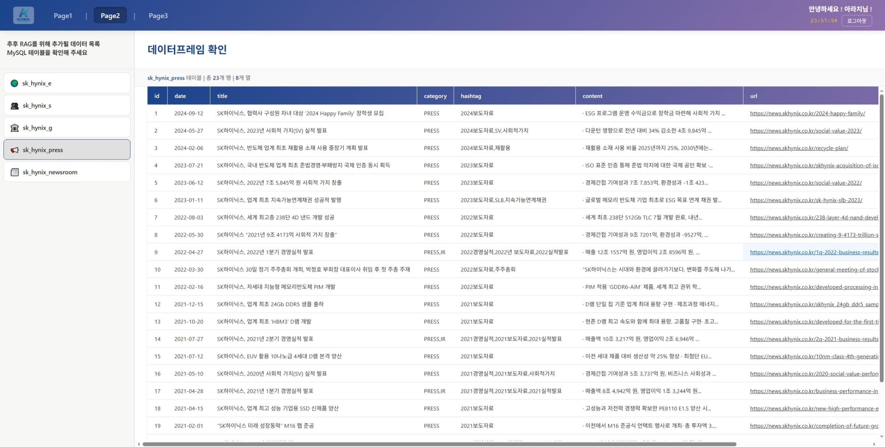
</p>


**2026-05-30: AWS EC2, Docker 설치 및 연동**
- 챗봇에 Tavily 웹검색 기능 추가 및 간단한 마이너 수정
- `.env` 파일 수정 및 분리: `.env.development`: 종합적인 서버내 구성 세팅, `.env.production`: 개인 API키와 같은 외부 연결 세팅 (위 실행 방법 참조)
- Raw DB를 위한 새로운 html 추가 및 css/js 코드 분리: `app/static/css`, `app/static/js`
- 도커와 AWS 연동을 위한 필요 파일 준비 및 가이드라인 작성
- 추후 ollama 벡터 임베딩 활용을 위해 설치 코드 추가
- 자동 배포(CI/CD) 설정 코드 yml파일 작성


**2026-06-06**
- 준비된 수치데이터, 텍스트/테이블 데이터 (ex. 작년 ESG보고서), 뉴스 및 게시글 텍스트 데이터의 RAG 활용 방법 탐구
- `marker-pdf` 파이썬 라이브러리를 활용하여 2024년 ESG 보고서의 모든 텍스트/테이블/이미지 스캔 후 **텍스트와 테이블(마트다운 형태)만 저장**
- 2025년 ESG 보고서 작성을 위한 2024년 ESG 보고서 카테고리 설정 업무 분배 (ChromaDB에 보관하기 위해 **metadata 형식으로 준비가 필요함**)\
  글의 성격이 E(환경)에 관련된 것인지, S(사회)인지, G(경제/거버넌스)인지
- LLM은 정확한 수치를 핸들링하는것에 어려움이 있다고 하여 이를 MySQL DB를 자동화를 이용해 끌고오는 방법이 더 탐구되어야 함
- 우선적으로 '2024년 보고서의 CEO Message' 부분을 '2025년 보고서의 Letter to our Stakeholders'에 맞춰 사전 진행 시작


**2026-06-14**
- RAG활용을 위한 ESG 수치데이터, 보고서의 텍서트/테이블 (이미지 제외), 뉴스 및 보도기사 텍스트 레이아웃 수정 후 MySQL에 재업로드
- E,S,G 부분을 서로 다른 색깔로 하이라이트하여 구분된 보고서 pdf파일의 추출된 내용(`preprocess\marker-pdf\_content_v1.txt`)을 청크(문단)별로 **수기로 분류**하여 `datasets\content_db.xlsx`의 형식으로 저장
- 보고서 내용 content 컬럼의 경우 띄어쓰기 문제가 있어 `kiwipiepy` 파이썬 라이브러리를 활용하여 띄어쓰기 획일화 (한국어 임베딩 문제 완화)
- ChromaDB(로컬 persistent) 활용을 위한 ids, embeddings(Ollama `bge-m3`), documents, metadatas 데이터별로 다양한 구성으로 분류 및 저장: `app\modules\rag\indexer.py`
- 현재까지의 버전으로는 랭체인/랭그래프를 시작하기 앞서 RAG를 위한 chromadb의 데이터를 잘 읽어오는지 확인을 위해 `app/modules/rag/`폴더 내 파일들을 통해 인덱싱 및 결과확인 코드 작성
- 첫스텝으로 n_collections=3 으로 설정하여 무조건 각 db내에서 3개씩 검색결과 반환 기능 적용 확인 (아래 이미지 참조)
<p align="left">
  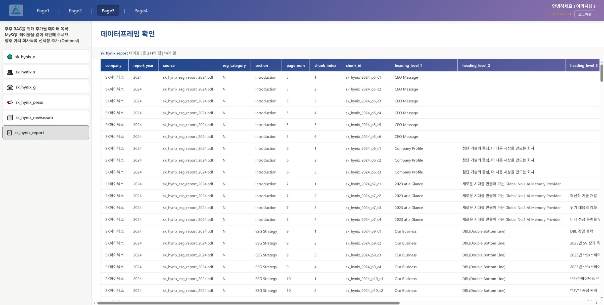
  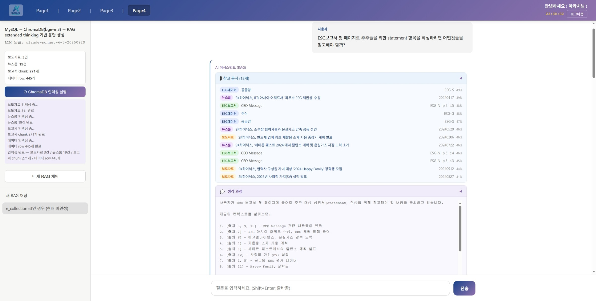
</p>


**2026-06-26**
- redis 토큰 추출 및 제거 코드 마이너 업데이트
- 개인 클로드 anthropic api키 사용을 조직 클로드 anthropic bedrock api 사용으로 대체
- 검색 품질 향상을 위한 ChromaDB 부문 documents 및 metadata 섹션 구체화
- 보고서 작성을 위한 RAG를 랭체인/랭그래프를 활용하여 총 3단계로 구현: QA_GRAPH, REPORT_GRAPH, SECTION_GRAPH
- [QA_GRAPH] page4, 챗봇 스타일 ChromaDB Q&A 플로우
  - START → analyze_query → retrieve_docs → END
  - analyze_query: Haiku로 쿼리 의도(qa/data_lookup/report_section)와 E/S/G 카테고리를 추론. 검색 전략 파라미터 결정
  - retrieve_docs:  분석 결과에 맞는 컬렉션/k값/임계값으로 검색
  - 최종 생성(LLM 호출)은 service.py에서 SSE 스트리밍으로 수행
- [REPORT_GRAPH] page5, ESG 보고서 일괄 자동 작성 플로우 (Map-Reduce 패턴, 사람 개입 없음)
  - START → plan → [process_section × N, 병렬] → synthesize → END
  - plan: 전년도 보고서를 검색하여 섹션 목록 수립
  - process_section: 섹션별 검색 + 초안 생성. Send API로 병렬 실행
  - synthesize: 모든 섹션 초안을 취합하여 최종 보고서 생성
<p align="left">
  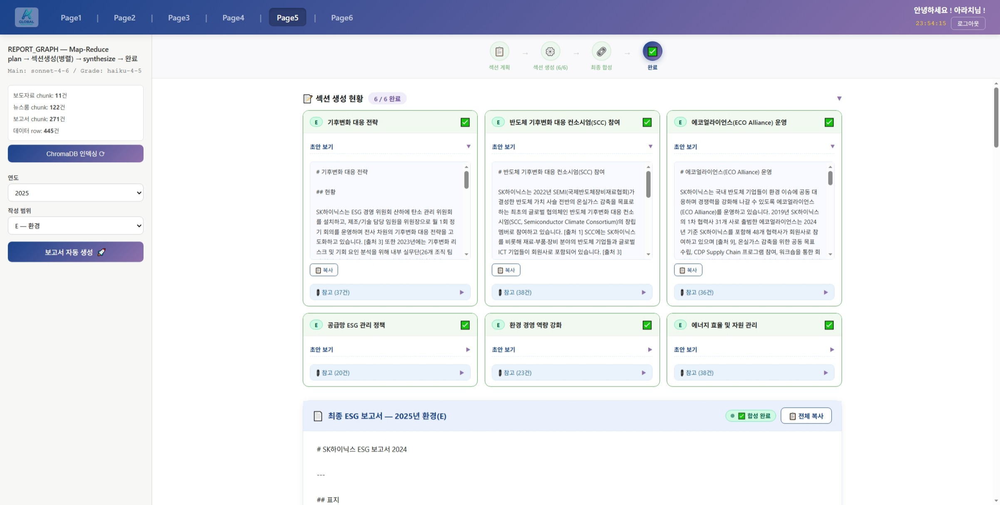
  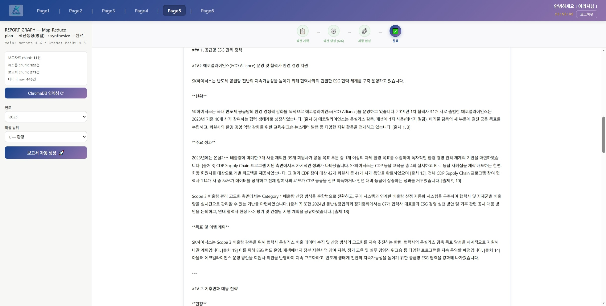
</p>
- [SECTION_GRAPH] page6, ESG 보고서 단일 섹션 작성/수정 플로우 (Human-in-the-loop(HITL) interrupt + AsyncSqliteSaver)
  - START 검색 → Self-RAG 평가 → 문서 검토(사람) → 초안 생성 → 초안 검토(사람) → (반려/수정/추가검색에 따라 앞 단계로 순환) → 승인 시 END
  - REPORT_GRAPH와 달리 "섹션 하나"를 사람이 매 단계 승인하며 다듬는 대화형 워크플로우
  - 기존 구조에 맞게 컴파일 시점에 AsyncSqliteSaver 체크포인터 활용
<p align="left">
  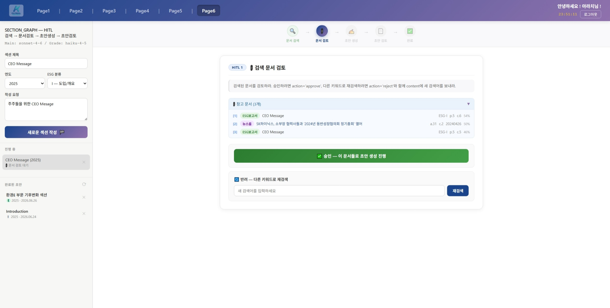
  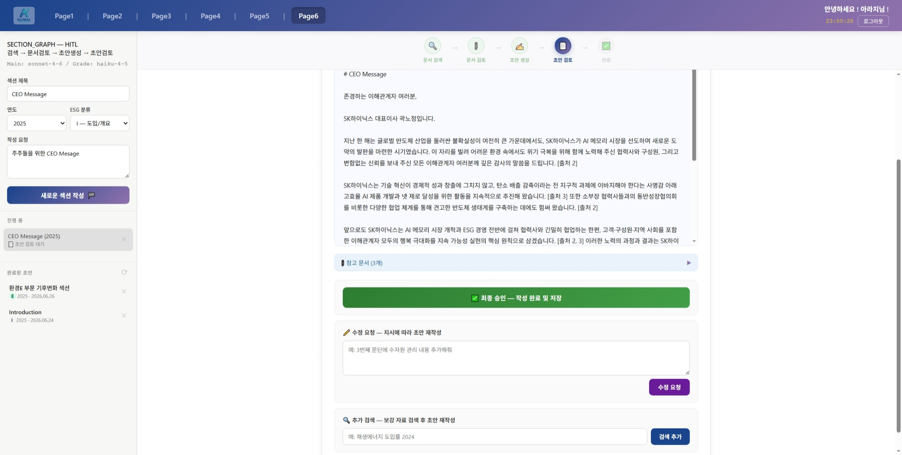
</p>


**2026-07-05**
- docker-compose 헬스체크 로직 적용
- page2 raw 데이터 관리 및 시각화 페이지를 위한 전처리 진행 `preprocess/data_prep_csv.py`, 다음과 같은 더미 데이터에서 csv만 추출하여 진행: `RAWDATA_ERP.csv` & `RAWDATA_GHG.xlsx`
- `app/static/js/` 폴더내 전체 파일의 redis 토큰 만료 타이머 오류 수정
- `retriever.py` QA및 RAG에서 검색시 threshold 수치 및 검색 개수 변경
- http미지원 에러로 텍스트가 복사되지 않는 문제 수정: navigator.clipboard.writeText 형식을 임의의 function copyText(text) 형식으로 대체
- raw 데이터 엑셀파일 csv 변환 및 수식을 SQL 로직으로 변경하여 적용 및 html 화면에 로직 toggle박스로 출력
- 일반적인 대시보드 구축 대신 간단하게 버튼을 눌러 현재 html화면에 나타나 있는 데이터를 오버레이로 시각화된 그래프 출력
- 시각화시 LLM을 통한 이미지 생성이 아닌, 그래프 생성을 위한 json 파일 생성이며 이후 생성된 json 파일을 기반으로 Chart.js를 활용하여 시각화 진행, PNG파일 로컬 다운로드 가능
- 구체적인 모든 기능은 `app/modules/db/api_rawdb.py` 파일 참조
<p align="left">
  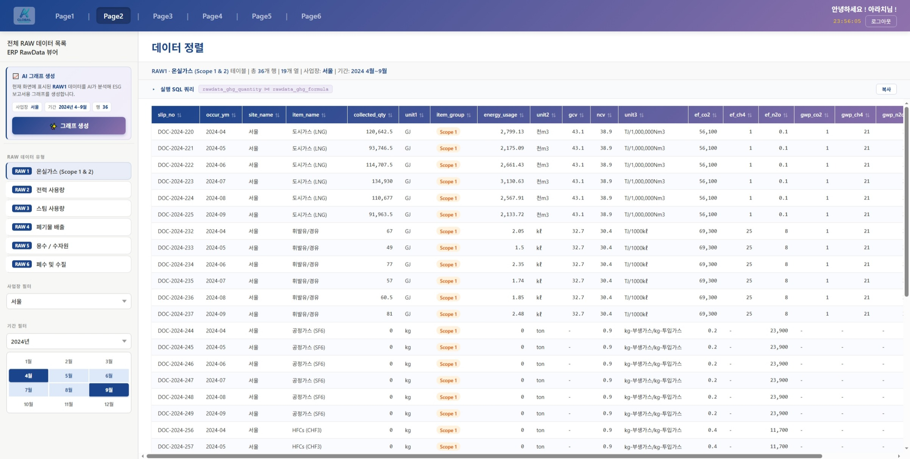
  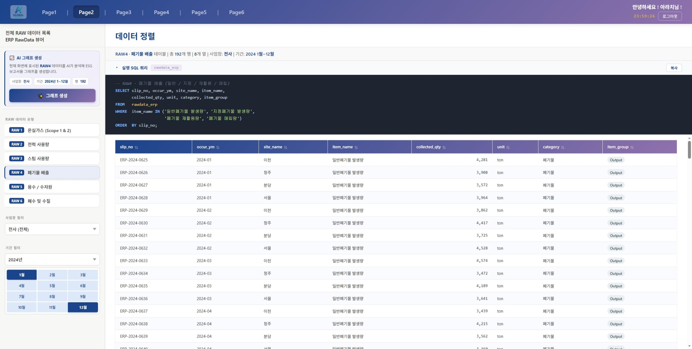
</p>
<p align="left">
  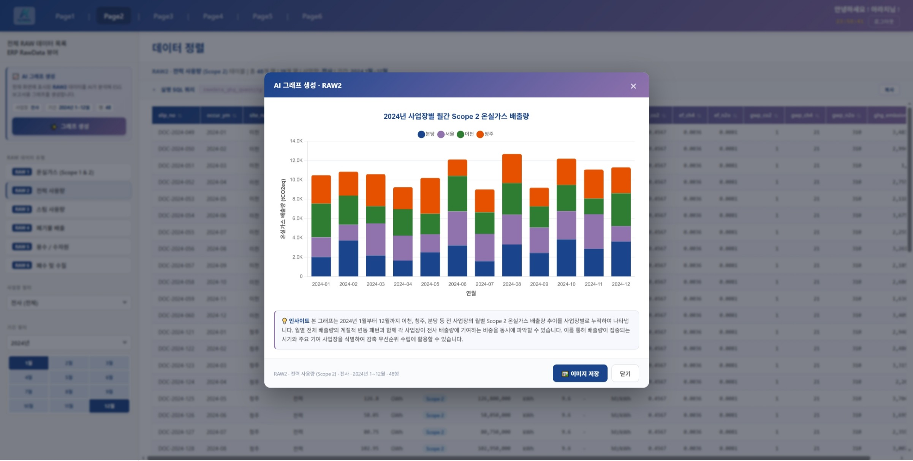
  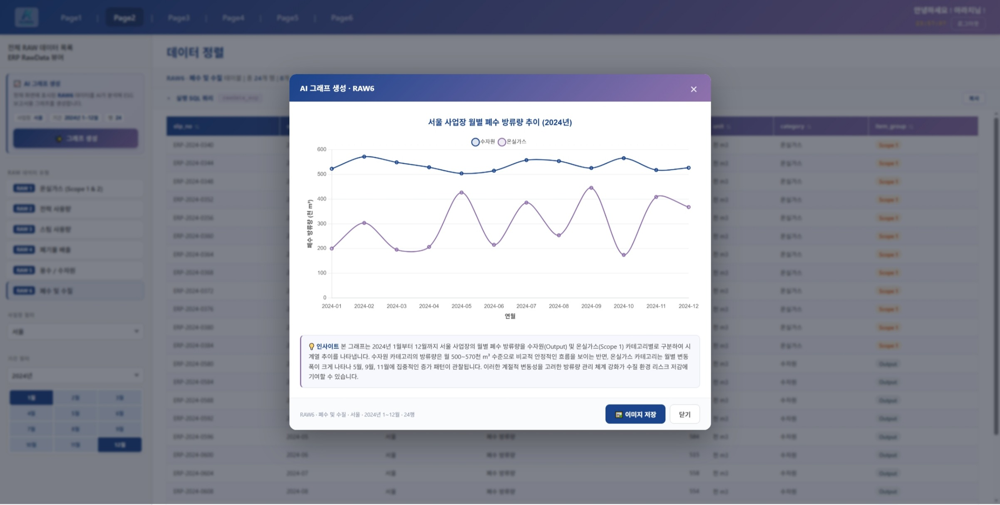
</p>

</br>

#

</br>

### 기술 스택 및 필요 사항
requirements.txt 참조
- HTML/CSS
- jQuery (3.6.4)
- FastAPI (0.136.1)
- Python (3.11)
- MySQL (8.0)
- Redis (7-alpine)
- Docker
- AWS EC2
- Claude API
- Tavily API
- Ollama (0.30.6)
- ChromaDB (1.5.9)
- LangChain (1.3.9)
- LangGraph (1.2.5)
